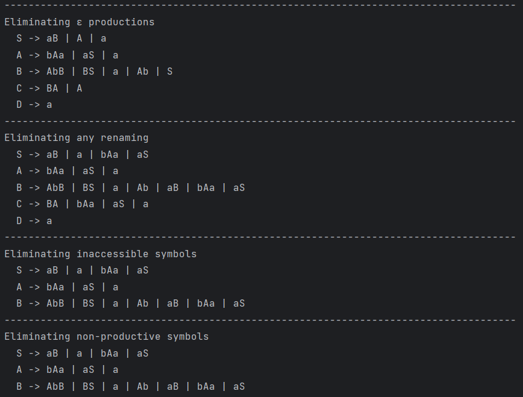
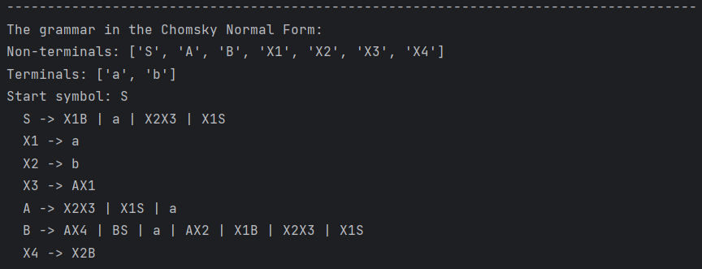

# LAB 5: Chomsky Normal Form

### Course: Formal Languages & Finite Automata
### Author: Janeta Grigoras

----

## Theory
Chomsky Normal Form (CNF) is a simplified way of representing context-free grammars, which is particularly useful for parsing and formal language analysis. In CNF, every production rule must be in one of the following forms:

* A → BC, where A, B, and C are non-terminal symbols (B and C are not the start symbol), or

* A → a, where A is a non-terminal and a is a terminal symbol,

* or S → ε, only if ε (the empty string) is in the language and S is the start symbol.

Converting a grammar to CNF involves several transformation steps: eliminating ε-productions, unit productions (renamings), inaccessible symbols, and non-productive symbols, and then converting the remaining productions into the CNF format.


## Objectives:

* Learn about Chomsky Normal Form (CNF).
* Get familiar with the approaches of normalizing a grammar.
* Implement a method for normalizing an input grammar by the rules of CNF.
  * The implementation needs to be encapsulated in a method with an appropriate signature (also ideally in an appropriate class/type).
  * The implemented functionality needs executed and tested.
  * Also, another BONUS point would be given if the student will make the aforementioned function to accept any grammar, not only the one from the student's variant.


## Implementation description

* I implemented variant 14:
    ```
    VN={S, A, B, C, D}, 
    VT={a, b}, 
    P={ 
        S → aB
        S → A
        A → bAa
        A → aS
        A → a
        B → AbB
        B → BS
        B → a
        B → ε
        C → BA
        D → a
    }
    ```
* Cnf Class:
  * **Step 1. Remove ε-productions (null productions)**
    * In the eliminate_epsilon_productions method, I focused on removing all the productions that generate ε (the empty string), except for the start symbol. 
    * First, I create a copy of the grammar's production rules in new_grammar, ensuring that I don't modify the original grammar directly. I set changed = True to enter the while changed loop, which will continue until no further changes are made to the grammar.
    ```python
      def eliminate_epsilon_productions(self, grammar):
          new_grammar = {s: p[:] for s, p in grammar.P.items()}
          changed = True
    ```
    * Inside the loop, I initialize an empty list N_e to keep track of symbols that can derive the empty string (ε). For each non-terminal symbol and its associated productions in the grammar, I check if any production is just "ε". If so, I mark that symbol as able to derive ε and add it to N_e. This part is implemented as:
    ```python
          while changed:
              changed = False
              N_e = []

              for symbol, productions in grammar.P.items():
                  for production in productions:
                      if production == "ε" and symbol != "S":
                          N_e.append(symbol)
                          changed = True
              if not N_e:
                  break
    ```
    * The changed = True flag ensures that the loop continues until no more epsilon-producing symbols are found.
    * After identifying symbols that can derive ε, I proceed to eliminate their epsilon productions. I iterate over N_e, and for each symbol that produces ε, I modify the productions of other symbols that contain it. For every production containing an epsilon-producing symbol, I generate all possible combinations where the epsilon-producing symbol is removed. I create new productions for the grammar by replacing the epsilon-producing symbol with the empty string ('ε'), or by removing it entirely.
    ```python
              for null_p in N_e:
                  # print(f"were at symbol {null_p}")
                  for symbol, productions in grammar.P.items():
                      for production in productions:
                          # print(production)
                          if production.count(null_p) > 0:
                              positions = [i for i, x in enumerate(production) if x == null_p]
                              # print(positions)
                              new_production = set()
                              for r in range(1, len(positions) + 1):
                                  combos = combinations(positions, r)
                                  for comb in combos:
                                      new_prod = list(production)
                                      for pos in comb:
                                          new_prod[pos] = 'ε'

                                      new = ''.join([ch for i, ch in enumerate(production) if i not in comb])
                                      if new == '':
                                          new = 'ε'

                                      if new not in grammar.P[symbol]:
                                          new_production.add(new)
                                  for element in new_production:
                                      if element not in new_grammar[symbol]:
                                          new_grammar[symbol].append(element)
    ```
    * After processing the symbol, I remove the epsilon production ("ε") from the list of productions for the symbol null_p. Once all epsilon productions are eliminated, I update the original grammar's production rules with the newly modified new_grammar. Finally, I return the grammar after epsilon productions have been removed:
    ```python
                  new_grammar[null_p].remove("ε")

              grammar.P = {s: p[:] for s, p in new_grammar.items()}
          grammar.P = new_grammar

          return grammar
      ```
  * **Step 2: Eliminating Renaming (Unit) Transitions**
    * In the eliminate_renaming method, my goal was to remove all renaming rules—those that simply map one non-terminal to another, like A → B. 
    * I start by setting changed = True to enter the while changed loop. This will ensure the loop runs as long as changes are being made to the grammar.Inside the loop, for each symbol (non-terminal) in the grammar's production rules (grammar.P.keys()), I initialize two lists: 
      * new_productions: to store any new productions generated by eliminating renaming. 
      * to_remove: to store the productions that need to be removed after the renaming is processed.
    ```python  
      def eliminate_renaming(self, grammar):
          changed = True
          while changed:
              changed = False
              for symbol in grammar.P.keys():
                  new_productions = []
                  to_remove = []
    ```
    * For each production associated with a symbol, I check if the production is a single symbol (i.e., it consists of only one non-terminal) and if that symbol also has its own productions in the grammar (i.e., it is a non-terminal). If this is the case, the production is a renaming production (e.g., A -> B), where A is a non-terminal symbol and B is another non-terminal. If a renaming production is found, I look at the productions of the renamed symbol (i.e., grammar.P[renamed]) and add any new productions from this renamed symbol to new_productions, unless they are already present for the current symbol or in new_productions. If any changes are made, I set changed = True.
    ```python
                  for production in grammar.P[symbol]:
                      if len(production) == 1 and production[0] in grammar.P:
                          renamed = production[0]
                          for p in grammar.P[renamed]:
                              if p not in grammar.P[symbol] and p not in new_productions:
                                  new_productions.append(p)
                                  changed = True
                          to_remove.append(production)
    ```
    * After collecting all the renaming productions for a symbol, I proceed to remove them from the grammar. This is done using the to_remove list. I then extend the current symbol’s productions with the new productions I just collected (new_productions). The loop continues until no more renaming productions are found and eliminated, i.e., when changed is False. Once all renaming productions have been eliminated, I return the modified grammar.
    ```python
                  for prod in to_remove:
                      grammar.P[symbol].remove(prod)
                  grammar.P[symbol].extend(new_productions)
          return grammar
    ```
  * **Step 3: Eliminating Inaccessible Symbols**
    * The remove_inaccessible_symbols method was designed to eliminate any non-terminal that can’t be reached starting from the start symbol.
    * First, I define accessible as a set containing just the start symbol (grammar.S). This is the starting point for the process of finding which symbols can be reached from the start symbol.
      ```python
      def remove_inaccessible_symbols(self, grammar):
          accessible = set(grammar.S)
      ```
      * I enter a while changed loop, which will continue running as long as changes are made to the set of accessible symbols. Inside the loop, I create a copy of the accessible set (as current) to avoid modifying the set while iterating over it. This allows me to check if new symbols can be added to the accessible set.
      * For each symbol in the current list (which is a copy of the current accessible symbols), I check all the productions that the symbol can derive. For each production, I check each character (symbol) in the production. If the character is a non-terminal symbol (char in grammar.V_n), I add it to the accessible set. If any new symbol is added, I set changed = True to ensure the loop continues in the next iteration until no more symbols can be added.
      ```python
          changed = True
          while changed:
              changed = False
              current = list(accessible)
              for symbol in current:
                  for production in grammar.P[symbol]:
                      for char in production:
                          if char in grammar.V_n and char not in accesible:
                              accessible.add(char)
                              changed = True
      ```
      * After determining which symbols are accessible, I create a new dictionary new_P to store the productions only for accessible symbols. I iterate through the grammar's production rules (grammar.P.items()) and keep only those symbols that are in the accessible set. I then update the list of non-terminal symbols (grammar.V_n) to keep only the ones that are accessible. Finally, I return the modified grammar with only accessible symbols and their corresponding productions.
      ```python
          new_P = {s: p[:] for s, p in grammar.P.items() if s in accessible}
          grammar.P = new_P
          grammar.V_n = [v for v in grammar.V_n if v in accessible]
          return grammar
      ```
  * **Step 4: Eliminating Nonproductive Symbols**
    * In remove_non_productive, I worked on filtering out symbols that never lead to a terminal string.
    * I create an empty set productive, which will eventually contain all the symbols that can generate terminal strings.
    ```python
      def remove_non_productive(self, grammar):
          productive = set()
          changed = True
    ```
    * I enter a while changed loop to keep processing until no more symbols are identified as productive.
    * Inside the loop, I iterate through all the symbols in the grammar's production rules (grammar.P). For each symbol, I examine all of its productions. I check whether every symbol in the production is either a terminal symbol (s in grammar.V_t) or a productive symbol (i.e., already in the productive set). If all symbols in the production are either terminal or productive, the symbol is considered productive. If a symbol becomes productive (and it wasn't productive before), I add it to the productive set and set changed = True to trigger another iteration.
    ```python
          while changed:
              changed = False
              for symbol in grammar.P:
                  for production in grammar.P[symbol]:
                      if all(s in grammar.V_t or s in productive for s in production):
                          if symbol not in productive:
                              productive.add(symbol)
                              changed = True
    ```
    * After identifying all productive symbols, I create a new dictionary new_P to store the productions of only productive symbols.
    * For each symbol in the grammar, if it is in the productive set, I filter its productions by keeping only those that consist entirely of terminal symbols or other productive symbols. If any filtered productions remain for the symbol, I add them to new_P.
    ```python
          new_P = {}
          for s, prods in grammar.P.items():
              if s in productive:
                  filtered_prods = [p for p in prods if all(sym in grammar.V_t or sym in productive for sym in p)]
                  if filtered_prods:
                      new_P[s] = filtered_prods
    ```
    * I then update the grammar's production rules (grammar.P) with the filtered productions stored in new_P. Additionally, I update the list of non-terminal symbols (grammar.V_n) to keep only those symbols that are productive. Finally, I return the modified grammar with only productive symbols and their corresponding productions.
    ```python
          grammar.P = new_P
          grammar.V_n = [v for v in grammar.V_n if v in productive]
          return grammar
    ```
  * **Step 5: Obtaining Chomsky Normal Form (CNF)**
    * The obtain_cnf method is where I transformed the grammar into Chomsky Normal Form. Chomsky Normal Form (CNF) is a standard form for context-free grammars (CFGs) where each production rule is of one of the following forms:

      1. A → BC: A non-terminal symbol (A) is rewritten as exactly two non-terminal symbols (B and C).

      2. A → a: A non-terminal symbol (A) is rewritten as a single terminal symbol (a).

    * I create replacements, which is a dictionary to map terminals to new non-terminal symbols. This helps when I need to replace terminals with non-terminals. reverse_map is used to map the newly introduced non-terminal symbols back to the original terminal or production they represent. counter keeps track of the new non-terminal symbols I generate to replace terminals and pairs of symbols. new_productions stores the new set of productions, which will be used to update the grammar after conversion.
    ```python
      def obtain_cnf(self, grammar):
          replacements = {}
          reverse_map = {}
          counter = 1
          new_productions = {}
    ```
    * I loop through each non-terminal symbol in the grammar (grammar.P.keys()), where grammar.P stores the production rules. For each non-terminal symbol, I initialize an empty list in new_productions to hold its new productions.
    * Then, I loop through each production of the current symbol. If a production contains a terminal symbol and its length is greater than one, I replace the terminal symbol with a newly generated non-terminal symbol. For each terminal, if it hasn't been replaced before, I generate a new non-terminal (e.g., X1, X2, etc.) and map it to the terminal. I also add this new non-terminal to the list of non-terminals (grammar.V_n) and create a corresponding production for it (new_productions[rep] = [terminal]).
    ```python
          for symbol in grammar.P.keys():
              new_productions.setdefault(symbol, [])
              for production in grammar.P[symbol]:
                  chars = list(production)

                  for i in range(len(chars)):
                      if chars[i] in grammar.V_t and len(chars) > 1:
                          terminal = chars[i]
                          if terminal not in replacements:
                              rep = f"X{counter}"
                              counter += 1
                              replacements[terminal] = rep
                              reverse_map[rep] = terminal
                              grammar.V_n.append(rep)
                              new_productions[rep] = [terminal]
                          chars[i] = replacements[terminal]
    ```
    * After replacing terminals, if the production still has more than two symbols, I break the production down into binary rules (i.e., productions with exactly two symbols). I do this by taking the last two symbols of the production and creating a new non-terminal symbol to represent them. This ensures that all productions are in the form A → BC or A → a. I continue this process until each production has at most two symbols.
    ```python
                  while len(chars) > 2:
                      pair = ''.join(chars[-2:]) #last 2
                      if pair not in replacements:
                          rep = f"X{counter}"
                          counter += 1
                          replacements[pair] = rep
                          reverse_map[rep] = pair
                          grammar.V_n.append(rep)
                          new_productions[rep] = [pair]
                      chars = chars[:-2] + [replacements[pair]]
    ```
    * Once all the transformations are complete for a particular production, I append the modified production to new_productions for the current non-terminal symbol. After processing all the productions, I update the grammar with the new production rules stored in new_productions. Finally, I return the modified grammar, which is now in Chomsky Normal Form.
    ```python
                  new_productions[symbol].append(''.join(chars))
          grammar.P = new_productions
          return grammar
    ```
  * **Final Step**
    * Finally, in the convert_to_cnf method, I called all the previous transformations in the right order: removing epsilon rules, eliminating renamings, clearing inaccessible and non-productive symbols, and converting the rest into CNF. After each step, I printed the updated grammar so we can observe the transformations and how the grammar evolves at each stage. This full process guarantees that we end up with a simplified and equivalent grammar that follows the strict CNF structure.


## Conclusions / Screenshots / Results
* To test my code I generated I used the grammar from variant 14:




* In conclusion, this laboratory work taught me how to eliminate epsilon productions, remove renaming rules, and handle non-productive and inaccessible symbols in a grammar, all in order to bring it into Chomsky Normal Form. These steps are essential for converting a grammar into a more standardized and efficient form for use in parsing and language analysis. By applying these concepts, I gained a deeper understanding of formal languages and the importance of simplifying grammars to make them more practical for computational tasks.

* This work will be valuable in the future as it strengthens my ability to manipulate and optimize grammars, which will be useful in compiler design, language processing, and other areas of formal language theory. Understanding these transformations also provides a foundation for working with more complex language models and algorithms, making me better prepared for future tasks that require working with formal grammars and automata.

## References
* [Context free grammars](https://drive.google.com/file/d/19muyiabGeGaoNDK-7PeuzYYDe6_c0e-t/view)
* [itertools — Functions creating iterators for efficient looping](https://docs.python.org/3/library/itertools.html#itertools.combinations)