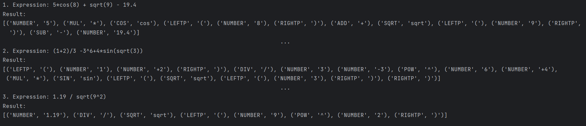

# LAB 3: Lexer & Scanner

### Course: Formal Languages & Finite Automata
### Author: Janeta Grigoras

----

## Theory
In the context of formal languages and finite automata, a lexer plays a fundamental role in the process of lexical analysis, which is one of the first stages of compiling or interpreting a language. Formal languages are defined by specific sets of strings that follow a particular set of rules or grammar, and finite automata are mathematical models used to recognize patterns within these strings. A lexer, in this context, takes a string of characters from the input and breaks it down into smaller, meaningful units called lexemes. Each lexeme is then categorized into a token, which represents a class of lexemes that share certain characteristics.

Finite automata, particularly deterministic finite automata (DFA) and nondeterministic finite automata (NFA), are often used to describe the patterns of these tokens. The lexer uses these models to identify regular expressions or patterns in the input string and produce corresponding tokens. For example, when a lexer processes a string, it might use a finite automaton to match characters that represent an integer, a floating-point number, or a specific keyword like "sin" or "cos". Each matched pattern corresponds to a token, which can be classified based on its role in the language's grammar.

In this context, the lexer doesn't necessarily need to remember the exact value of each lexeme but instead identifies its type—such as integer, operator, or function name—using the patterns defined by the formal language. By applying the principles of finite automata, the lexer simplifies the input, transforming it into a stream of tokens that can be further processed by the parser or interpreter. This process is essential in ensuring that the input is correctly recognized and understood by the system, and that further analysis or computation can be performed efficiently.


## Objectives:

---
1. Understand what lexical analysis is.
2. Get familiar with the inner workings of a lexer/scanner/tokenizer.
3. Implement a sample lexer and show how it works.
## Implementation description

---
In my implementation of the lexer, I use regular expressions (regex) to identify different patterns in a given mathematical expression and categorize them into tokens.

To begin with, I define a list called TOKENS, which contains pairs of token names and their associated regex patterns. These patterns match specific components of the expression, such as numbers, operators, mathematical functions, and parentheses. For example, I use the pattern [+-]?\d+(\.\d+)? to match integers or floating-point numbers, etc.

Next, I join all these individual patterns into a single regex string stored in the regex variable. This string is created by combining the named capture groups from each pattern using the | (OR) operator. Each named group corresponds to a token type like "NUMBER", "SUB", "ADD", etc.
```python
TOKENS = [
    ("NUMBER", r"[+-]?\d+(\.\d+)?"),
    ("SUB", r"\-"),
    ("ADD", r"\+"),
    ("DIV", r"\/"),
    ("MUL", r"\*"),
    ("SIN", r"sin"),
    ("COS", r"cos"),
    ("POW", r"\^"),
    ("SQRT", r"sqrt"),
    ("LEFTP", r"\("),
    ("RIGHTP", r"\)"),
    ("SPACE", r"\s+")
]

regex = "|".join(f"(?P<{name}>{pattern})" for name, pattern in TOKENS)
```
The lexer function takes an input string, expression, and processes it using the regex pattern. It then uses re.finditer(regex, expression) to find all matches in the input string. This returns an iterable of match objects, and for each match, I check the lastgroup property to identify the type of the token and use group() to get the matched substring (lexeme).

If the matched token is a whitespace ("SPACE"), I simply skip it. Otherwise, I append a tuple containing the token type and its corresponding value (lexeme) to the tokens list.

At the end, the function returns the tokens list, which now contains pairs of token types and their values, representing the lexical analysis of the input expression. This list of tokens can be used for further processing, such as parsing or evaluating the expression. By using regular expressions, I can efficiently identify and categorize the components of the expression into meaningful tokens based on predefined patterns.
```python
def lexer(expression):
    tokens = []

    for match in re.finditer(regex, expression):
        kind = match.lastgroup
        token = match.group()

        if kind == "SPACE":
            continue
        else:
            tokens.append((kind, token))

    return tokens
```

## Conclusions / Screenshots / Results
Examples:

* This laboratory work provided me with a deeper understanding of lexical analysis and the role of a lexer in processing input strings. By implementing a lexer, I learned how to use regular expressions to identify different token types, which is a fundamental step in language processing. This experience allowed me to see firsthand how a lexer transforms raw input into structured tokens, making it easier for further analysis.

In the future, this knowledge will be invaluable when implementing a parser, as lexical analysis is the first step in the compilation or interpretation process. Understanding how tokens are generated and categorized will help me design more efficient syntax analysis methods. Additionally, the concepts I applied here can be extended to more complex language processing tasks, such as building interpreters or compilers. Overall, this lab strengthened my grasp of formal languages and finite automata, providing a solid foundation for more advanced topics in programming language design.
* ## References
* [ A sample of a lexer implementation](https://llvm.org/docs/tutorial/MyFirstLanguageFrontend/LangImpl01.html)
* [Lexical analysis](https://en.wikipedia.org/wiki/Lexical_analysis)
* [Regex101](https://regex101.com/)