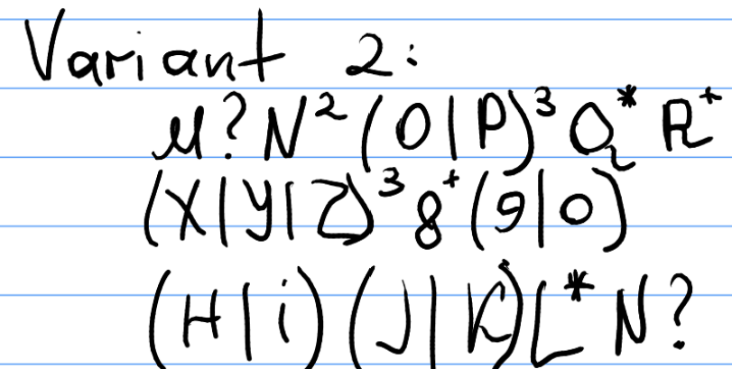
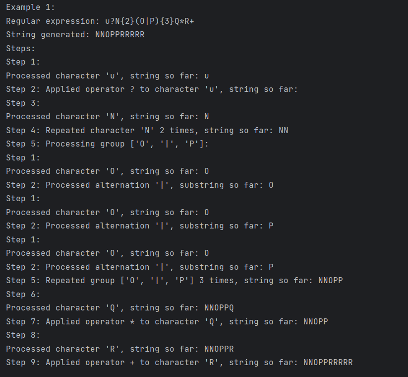
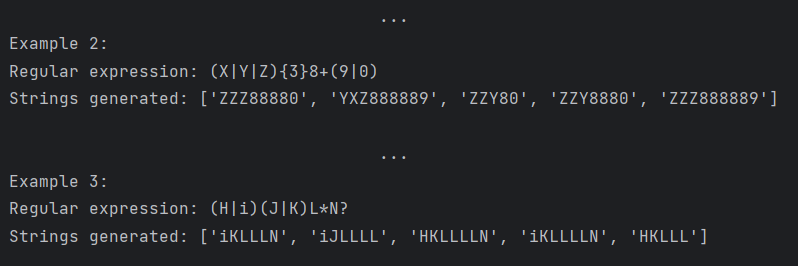

# LAB 4: Regular expressions

### Course: Formal Languages & Finite Automata
### Author: Janeta Grigoras

----

## Theory
Regular expressions (regex) are patterns used to match and manipulate strings of text. They provide a concise way to describe text search patterns for tasks like validation, extraction, or replacement. Regex uses metacharacters and symbols to define how text should be matched. Common uses include validating formats like email addresses, finding specific patterns in large texts, and extracting useful information. The syntax of regular expressions is quite flexible, allowing for precise control over how patterns are matched, making them a versatile tool in programming, text processing, and data validation.

## Objectives:

---
1. Write a code that will generate valid combinations of symbols conform given regular expressions (examples will be shown). The idea is to interpret the given regular expressions dynamically, not to hardcode the way it will generate valid strings. Given a set of regexes as input, valid word will be generated as an output
2. In case of an example, where a symbol may be written undefined number of times, limit of 5 times is taken (to evade generation of extremely long combinations).
3. Bonus point: write a function that will show sequence of processing regular expression (like, what you do first, second and so on)
## Implementation description

---
At the beginning, my first approach to solving the task was to break down all the elements in the regular expression and check if they had any symbols associated with them, like quantifiers (*, +, ?) or repetition patterns ({}), which would help determine how the string could be generated. This seemed like a logical way to handle different parts of the expression individually. However, as I started implementing this idea, I quickly realized that it was becoming too complicated, especially when I needed to account for nested patterns and combinations of symbols. Generating strings based on this approach would require careful handling of multiple rules and would involve extensive logic to correctly interpret the regular expression.

So, I decided to take a different route: using tokens. I opted to use a tokenization approach, where I break the regular expression down into smaller, manageable components—tokens—such as characters, groups, and operators. This would make it easier to work with each part of the expression and would allow me to implement a more streamlined solution.
### Step-by-step explanation of my solution:
1. Tokenization

    The first thing I did was break down the given regular expression into smaller components, called tokens. I used the re.findall function to split the expression into individual parts such as characters, groups, quantifiers, and operators. This allowed me to handle each part of the expression separately and more easily.
    ```python
    def tokens(expression):
        return re.findall(r"(\(|\)|\+|\?|\*|\||\{[^}]*\}|\w+)", expression)
    ```

    This function returns a list of tokens that can be things like characters ('u', 'N'), special symbols ('+', '*', '|'), or even groups inside parentheses like '(O|P)'.
    For example:

    ```python
    expression = 'u?N{2}(O|P){3}Q*R+'
    tokens = ['u', '?', 'N', '{2}', '(', 'O', '|', 'P', ')', '{3}', 'Q', '*', 'R', '+']
    ```
2. Processing each token

    After tokenizing the regular expression, I needed to process each token one by one. I created the get_string function to handle this. I looped through the tokens to determine what each one meant and then performed the appropriate actions.

    **Characters**
    
    If the token is an alphanumeric character, I simply added it to the result string.
    ```python
    if char.isalnum():
        string += char
        log_step(step, f"Processed character '{char}', string so far: {string}")
    ```
    For example, if the current token was 'u', I added it to the string and logged the step to show my progress.
    
    **Groups**
    
    When I encountered a group (like '(O|P)'), I collected all the tokens inside the parentheses and processed them recursively using the get_string function.
    ```python
    elif char == '(':
        group = []
        i += 1
        while tokens[i] != ')' and i < len(tokens):
            group.append(tokens[i])
            i += 1
        i += 1
        log_step(step, f"Processing group {group}:")
    ```
    I made sure to handle the group properly by collecting all tokens inside the parentheses until I encountered a closing ')'.
    **Quantifiers**
    
    If I found a quantifier, I applied it to the previous character or group. For example, if I found a *, it meant I needed to repeat the previous element 0 to 5 times.
    ```python
    if i < len(tokens) and tokens[i] in ['*', '+', '?']:
        result = get_string(group)
        string += repeat(result, tokens[i])
        i += 1
        log_step(step, f"Applied operator {tokens[i]} to group, string so far: {string}")
    ```
    I also handled curly braces {} to repeat a group a specified number of times. For example, if I encountered {3}, I repeated the group 3 times.
    
    **Alternations**
    
    When I encountered the alternation symbol |, I needed to choose between multiple options. For example, if I encountered (O|P), I randomly selected either 'O' or 'P'.
    ```python
    elif char == '|':
        options = [string]
        i += 1
        if tokens[i] == '(':
            group = []
            i += 1
            while tokens[i] != ')' and i < len(tokens):
                group.append(tokens[i])
                i += 1
            options.append(get_string(group))
        else:
            options.append(tokens[i])
        string = random.choice(options)
        i += 1
        log_step(step, f"Processed alternation '|', substring so far: {string}")
    ```
    I created a list of options and randomly chose one to append to the string.

   3. Applying quantifiers
       I also wrote a repeat function to handle the application of quantifiers like *, +, and ?. This function is crucial for controlling how many times an element should appear in the final string.
    ```python
    def repeat(group, symbol):
        if symbol == '?':
            choice = random.random()
            if choice > 0.5:
                return group
            else:
                return ''
        elif symbol == '*':
            choice = random.randint(0, 5)
            new = ''
            for _ in range(choice):
                new += group
            return new
        elif symbol == '+':
            choice = random.randint(1, 5)
            new = ''
            for _ in range(choice):
                new += group
            return new
        elif symbol.startswith('{'):
            return group
    ```
    This function checks the quantifier and repeats the group accordingly. For example, * allows the group to appear between 0 and 5 times, while + ensures that the group appears at least once.
4. Building the final string

    Once I processed all the tokens, I concatenated everything together to form a valid string that matches the regular expression. The string was built progressively as I handled each token and applied quantifiers, groups, and alternation.
5. Logging the Steps

    Throughout the process, I wanted to track my progress, so I wrote the log_step function. This function logs the details of each action I took during the string generation process, such as processing a character or applying a quantifier.
    ```python
    def log_step(step, details):
        print(f"Step {step}: {details}")
    ```


## Conclusions / Screenshots / Results
1. To test my program I used the regular expressions from variant 2:

   

   These were my results:

   
   
2. In conclusion, this lab has significantly improved my understanding of regular expressions and how they are processed. By implementing the solution to dynamically generate valid strings based on regular expressions, I was able to dive deeper into the structure and behavior of regex patterns. The process of tokenizing and handling different parts of the expression, such as characters, groups, quantifiers, and alternations, helped me understand the intricacies of regex syntax and its flexibility. This experience will be valuable in the future, especially when working on text processing tasks like validation, extraction, and data manipulation, where regex is an essential tool. Additionally, the ability to dynamically generate valid strings will be helpful in situations where predefined patterns or hardcoded solutions are not viable, allowing for greater adaptability and efficiency in my future programming tasks.


## References
* [Regex Cheat Sheet](https://www.rexegg.com/regex-quickstart.php)
* [Python RegEx](https://www.w3schools.com/python/python_regex.asp)
* [Regex101](https://regex101.com/)