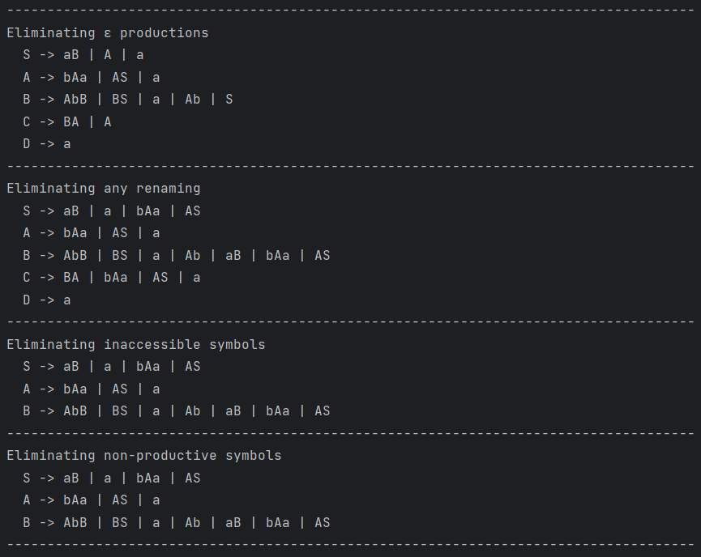
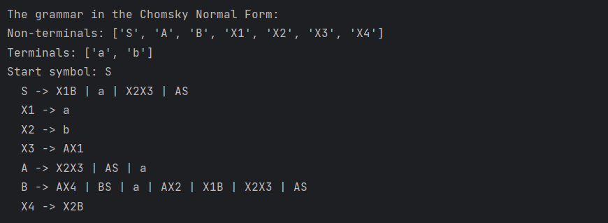

# LAB 5: Chomsky Normal Form

### Course: Formal Languages & Finite Automata
### Author: Janeta Grigoras

----

## Theory
Chomsky Normal Form (CNF) is a simplified way of representing context-free grammars, which is particularly useful for parsing and formal language analysis. In CNF, every production rule must be in one of the following forms:

* A → BC, where A, B, and C are non-terminal symbols (B and C are not the start symbol), or

* A → a, where A is a non-terminal and a is a terminal symbol,

* or S → ε, only if ε (the empty string) is in the language and S is the start symbol.

Converting a grammar to CNF involves several transformation steps: eliminating ε-productions, unit productions (renamings), inaccessible symbols, and non-productive symbols, and then converting the remaining productions into the CNF format.


## Objectives:

* Learn about Chomsky Normal Form (CNF).
* Get familiar with the approaches of normalizing a grammar.
* Implement a method for normalizing an input grammar by the rules of CNF.
  * The implementation needs to be encapsulated in a method with an appropriate signature (also ideally in an appropriate class/type).
  * The implemented functionality needs executed and tested.
  * Also, another BONUS point would be given if the student will make the aforementioned function to accept any grammar, not only the one from the student's variant.


## Implementation description

* I implemented variant 14:
    ```
    VN={S, A, B, C, D}, 
    VT={a, b}, 
    P={ 
        S → aB
        S → A
        A → bAa
        A → aS
        A → a
        B → AbB
        B → BS
        B → a
        B → ε
        C → BA
        D → a
    }
    ```
* Cnf Class:
  * In the eliminate_epsilon_productions method, I focused on removing all the productions that generate ε (the empty string), except for the start symbol. First, I made a copy of the original grammar so I wouldn't modify it directly. I then looked for non-terminals that produce ε and marked them as nullable. For each production in the grammar, I searched for nullable symbols and considered all the possible ways to remove them. Using combinations, I generated new forms of those productions by excluding the nullable symbols in different positions. I avoided duplicates and made sure I didn’t add ε unless it was specifically allowed for the start symbol. Finally, I removed the actual ε rules from non-start symbols to clean up the grammar.
  ```python
    def eliminate_epsilon_productions(self, grammar):
        new_grammar = {s: p[:] for s, p in grammar.P.items()}
        changed = True
        while changed:
            changed = False
            N_e = []

            for symbol, productions in grammar.P.items():
                for production in productions:
                    if production == "ε" and symbol != "S":
                        N_e.append(symbol)
                        changed = True
            # print(f"nulls {N_e}")

            if not N_e:
                break
            for null_p in N_e:
                # print(f"were at symbol {null_p}")
                for symbol, productions in grammar.P.items():
                    for production in productions:
                        # print(production)
                        if production.count(null_p) > 0:
                            positions = [i for i, x in enumerate(production) if x == null_p]
                            # print(positions)
                            new_production = set()
                            for r in range(1, len(positions) + 1):
                                combos = combinations(positions, r)
                                for comb in combos:
                                    new_prod = list(production)
                                    for pos in comb:
                                        new_prod[pos] = 'ε'

                                    new = ''.join([ch for i, ch in enumerate(production) if i not in comb])
                                    if new == '':
                                        new = 'ε'

                                    if new not in grammar.P[symbol]:
                                        new_production.add(new)

                                for element in new_production:
                                    if element not in new_grammar[symbol]:
                                        new_grammar[symbol].append(element)
                new_grammar[null_p].remove("ε")

            grammar.P = {s: p[:] for s, p in new_grammar.items()}
        grammar.P = new_grammar

        return grammar
    ```
  * In the eliminate_renaming method, my goal was to remove all renaming rules—those that simply map one non-terminal to another, like A → B. I did this by checking each production to see if it's a single non-terminal. When I found such a rule, I added the right-hand side of that non-terminal’s rules directly to the left-hand side's list of productions. This way, we avoid unnecessary steps in derivation. I used a loop to keep updating until there were no more such cases, even handling multiple levels of renaming like A → B → C.
  ```python  
    def eliminate_renaming(self, grammar):
        changed = True
        while changed:
            changed = False
            for symbol in grammar.P.keys():
                new_productions = []
                to_remove = []
                for production in grammar.P[symbol]:
                    if len(production) == 1 and production[0] in grammar.P:
                        renamed = production[0]
                        for p in grammar.P[renamed]:
                            if p not in grammar.P[symbol] and p not in new_productions:
                                new_productions.append(p)
                                changed = True
                        to_remove.append(production)
                for prod in to_remove:
                    grammar.P[symbol].remove(prod)
                grammar.P[symbol].extend(new_productions)
        return grammar
  ```
  * The remove_inaccessible_symbols method was designed to eliminate any non-terminal that can’t be reached starting from the start symbol. I began from the start symbol and recursively explored each production it leads to, marking all reachable non-terminals. Once I had this list, I removed all productions involving non-terminals that weren’t part of this accessible set.
    ```python
    def remove_inaccessible_symbols(self, grammar):
        accessible = set(grammar.S)
        changed = True
        while changed:
            changed = False
            current = list(accessible)
            for symbol in current:
                for production in grammar.P[symbol]:
                    for char in production:
                        if char in grammar.V_n:
                            accessible.add(char)
                            changed = False
        new_P = {s: p[:] for s, p in grammar.P.items() if s in accessible}
        grammar.P = new_P
        grammar.V_n = [v for v in grammar.V_n if v in accessible]
        return grammar
    ```
  * In remove_non_productive, I worked on filtering out symbols that never lead to a terminal string. I iteratively built a set of productive non-terminals, beginning with those that already directly produce only terminal symbols. If a production had only productive symbols, I considered the left-hand side productive too. After finalizing this set, I rebuilt the grammar to include only those non-terminals and their respective productions, removing anything that couldn’t contribute to actual word formation.
  ```python
    def remove_non_productive(self, grammar):
        productive = set()
        changed = True
        while changed:
            changed = False
            for symbol in grammar.P:
                for production in grammar.P[symbol]:
                    if all(s in grammar.V_t or s in productive for s in production):
                        if symbol not in productive:
                            productive.add(symbol)
                            changed = True

        new_P = {}
        for s, prods in grammar.P.items():
            if s in productive:
                filtered_prods = [p for p in prods if all(sym in grammar.V_t or sym in productive for sym in p)]
                if filtered_prods:
                    new_P[s] = filtered_prods

        grammar.P = new_P
        grammar.V_n = [v for v in grammar.V_n if v in productive]
        return grammar
  ```
  * The obtain_cnf method is where I transformed the grammar into Chomsky Normal Form. First, I replaced any terminal symbol that appears in the middle of a production with a new variable that produces only that terminal. This is necessary because CNF only allows terminal symbols in unit productions. Then, I handled cases where the right-hand side had more than two symbols. I did this by gradually replacing the end of the production with a new variable and repeating the process until only two symbols remained. To ensure uniqueness, I kept track of all the new variables and their definitions.
  ```python
    def obtain_cnf(self, grammar):
        replacements = {}
        reverse_map = {}
        counter = 1
        new_productions = {}

        for symbol in grammar.P.keys():
            new_productions.setdefault(symbol, [])
            for production in grammar.P[symbol]:
                chars = list(production)

                for i in range(len(chars)):
                    if chars[i] in grammar.V_t and len(chars) > 1:
                        terminal = chars[i]
                        if terminal not in replacements:
                            rep = f"X{counter}"
                            counter += 1
                            replacements[terminal] = rep
                            reverse_map[rep] = terminal
                            grammar.V_n.append(rep)
                            new_productions[rep] = [terminal]
                        chars[i] = replacements[terminal]

                while len(chars) > 2:
                    pair = ''.join(chars[-2:]) #last 2
                    if pair not in replacements:
                        rep = f"X{counter}"
                        counter += 1
                        replacements[pair] = rep
                        reverse_map[rep] = pair
                        grammar.V_n.append(rep)
                        new_productions[rep] = [pair]
                    chars = chars[:-2] + [replacements[pair]]

                new_productions[symbol].append(''.join(chars))
        grammar.P = new_productions
        return grammar
  ```
  * Finally, in the convert_to_cnf method, I called all the previous transformations in the right order: removing epsilon rules, eliminating renamings, clearing inaccessible and non-productive symbols, and converting the rest into CNF. After each step, I printed the updated grammar so we can observe the transformations and how the grammar evolves at each stage. This full process guarantees that we end up with a simplified and equivalent grammar that follows the strict CNF structure.


## Conclusions / Screenshots / Results
* To test my code I generated I used the grammar from variant 14:



* In conclusion, this laboratory work taught me how to eliminate epsilon productions, remove renaming rules, and handle non-productive and inaccessible symbols in a grammar, all in order to bring it into Chomsky Normal Form. These steps are essential for converting a grammar into a more standardized and efficient form for use in parsing and language analysis. By applying these concepts, I gained a deeper understanding of formal languages and the importance of simplifying grammars to make them more practical for computational tasks.

* This work will be valuable in the future as it strengthens my ability to manipulate and optimize grammars, which will be useful in compiler design, language processing, and other areas of formal language theory. Understanding these transformations also provides a foundation for working with more complex language models and algorithms, making me better prepared for future tasks that require working with formal grammars and automata.

## References
* [Context free grammars](https://drive.google.com/file/d/19muyiabGeGaoNDK-7PeuzYYDe6_c0e-t/view)
* [itertools — Functions creating iterators for efficient looping](https://docs.python.org/3/library/itertools.html#itertools.combinations)