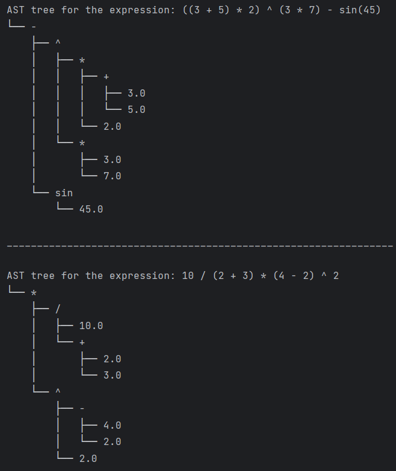
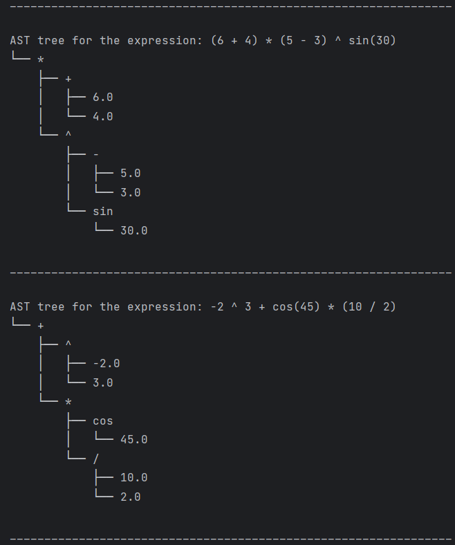
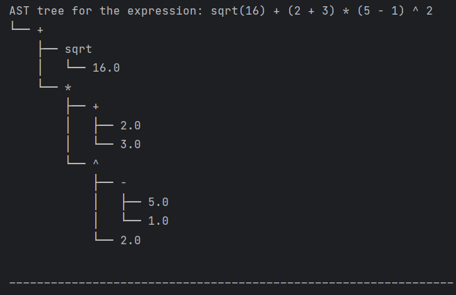

# LAB 6: Parser & Building an Abstract Syntax Tree

### Course: Formal Languages & Finite Automata
### Author: Janeta Grigoras

----

## Theory
Parsing is the process of analyzing a sequence of tokens (typically generated by a lexical analyzer) to determine its grammatical structure according to a given formal grammar. This syntactic analysis is a crucial phase in the compilation process, as it helps validate the structure of the input source code and transform it into a more usable form.

One common output of parsing is the parse tree (or concrete syntax tree), which explicitly represents the syntactic structure of the source code, including all grammar rules and tokens. While detailed, parse trees often contain redundant information, making them less practical for further stages of program analysis or code generation.

To address this, compilers and interpreters often convert parse trees into Abstract Syntax Trees (ASTs). An AST is a simplified, hierarchical representation of the program structure that omits unnecessary syntactic details like parentheses or specific grammar rules, focusing instead on the meaningful constructs of the language—such as expressions, statements, and function calls.

ASTs play a central role in compiler design and program analysis. They serve as the foundation for:

* **Semantic analysis** (type checking, scope resolution),

* **Optimization** (both high-level and low-level),

* **Code generation** (translating into intermediate or machine code),

* **Program transformation** (e.g., for linters, formatters, or transpilers).

Because of their abstraction, ASTs can also be used outside traditional compilers—for example, in interpreters, static analyzers, or tools that refactor or visualize code.


## Objectives:

* Get familiar with parsing, what it is and how it can be programmed.
* Get familiar with the concept of AST.
* In addition to what has been done in the 3rd lab work do the following:
  * Have a type TokenType (like an enum) that can be used in the lexical analysis to categorize the tokens. Use regular expressions to identify the type of the token.
  * Implement the necessary data structures for an AST that could be used for the text processed in the 3rd lab work.
  * Implement a simple parser program that could extract the syntactic information from the input text.

## Implementation description

I implemented a parser that works together with a lexer and an AST (Abstract Syntax Tree) builder. It uses a recursive descent parsing approach to handle mathematical expressions, taking into account operator precedence and associativity rules. To achieve this, I’ve split the parsing logic into multiple methods like parse_expression, parse_term, parse_power, and parse_factor.

The parser supports:

  * **Binary operations:** +, -, *, /, and ^

  * **Unary operations:** sin(), cos(), and sqrt()

  * **Grouping with parentheses:** ( ... )

  * **Numbers**, including both integers and floats
The result of parsing is an AST made up of Number, UnaryOperation, and BinaryOperation nodes, which can later be evaluated or used for further processing.

---
### I. **lexer.py file**:

In my lexer.py file, I implemented a simple and extensible lexer that uses regular expressions and enums to tokenize mathematical expressions.
1. First, I created an enumeration called TokenType to define all possible token categories. Each token is associated with a regular expression that matches a specific pattern in a mathematical expression:
   * NUMBER: matches integers and decimals (with optional + or - sign)
   * SUB, ADD, MUL, DIV, POW: match subtraction, addition, multiplication, division, and exponentiation operators 
   * SIN, COS, SQRT: match trigonometric and square root functions 
   * LEFTP, RIGHTP: match left and right parentheses 
   * SPACE: matches one or more whitespace characters (which I later ignore in the lexer)
  
     This enum helps me keep everything organized and makes the lexer easier to maintain or extend later.
   
     ```python
     class TokenType(Enum):
         NUMBER = r"[+-]?\d+(\.\d+)?"
         SUB = r"\-"
         ADD = r"\+"
         DIV = r"\/"
         MUL = r"\*"
         SIN = r"sin"
         COS = r"cos"
         POW = r"\^"
         SQRT = r"sqrt"
         LEFTP = r"\("
         RIGHTP = r"\)"
         SPACE = r"\s+"
     ```

2. Then, I built a single combined regular expression using all the patterns from the TokenType enum. I used **named capturing groups** (?P\<name\>pattern) so that when a match is found, I can identify which token type it corresponds to using match.lastgroup. This line ensures the lexer can scan the input expression in one pass, trying to match one of the defined token patterns.
    ```python
    regex = "|".join(f"(?P<{token.name}>{token.value})" for token in TokenType)
    ```
3. Lastly, I defined a function lexer() that takes a mathematical expression (as a string) and returns a list of tokens. I initialized an empty list tokens to store the results.
    Here, I used re.finditer() to scan the input expression for matches of my combined regex. For each match:
    * match.lastgroup gives me the name of the matched group (e.g., NUMBER, ADD)
    * match.group() gives me the actual matched text (e.g., '3', '+')
    ```python
    def lexer(expression):
        tokens = []
        for match in re.finditer(regex, expression):
            kind = match.lastgroup
            value = match.group()
    ```
    If the matched token is just whitespace, I skip it. For all other token types, I append a tuple (TokenType, value) to the tokens list. Using TokenType[kind] retrieves the enum member corresponding to the match group name. Then, I return the list of extracted tokens, which I can use later for my parser.
    ```python
            if kind == "SPACE":
                continue
            else:
                tokens.append((TokenType[kind], value))
        return tokens
    ```
### **II. AST.py file**
I defined the structure for representing an Abstract Syntax Tree (AST), which helps visualize the hierarchical structure of mathematical expressions after parsing. I also included a helper function to print the AST as a tree in the console, making it easy to debug or understand expression structure.
1. **Number node class**
    
      I created a class Number to represent a numeric literal (like 3 or 4.5) in the AST. It stores a single value in self.value.

      This is a **leaf node** — it doesn't contain any child nodes because it's just a constant.
      ```python
    class Number:
        def __init__(self, value):
            self.value = value
      ```
2. **BinaryOperation class**

      This class represents binary operations like addition, subtraction, multiplication, power, and division. It stores:
        
      * left: the left operand (which can be a Number, UnaryOperation, or another BinaryOperation)
      * op: the operator as a string (e.g., +, *)
      * right: the right operand
      This creates a **branching node** in the AST.
   
      ```python
    class UnaryOperation:
        def __init__(self, op, right):
            self.op = op
            self.right = right
    ```
3. **UnaryOperation class**

    This class handles unary operations like sqrt(x) or sin(x). It stores:

      * op: the unary operator (e.g., -, sin, cos, sqrt)

      * right: the operand the operator applies to

    It only has one child node — the right side.
    ```python
    class UnaryOperation:
        def __init__(self, op, right):
            self.op = op
            self.right = right
    ```
4. **Printing the AST**

    I defined a recursive function print_ast_tree() that prints the AST in a visually tree-like format. It takes:

    * node: the current AST node

    * prefix: indentation used to align the tree structure

    * is_tail: a flag to determine whether the current node is the last child in its branch (for drawing lines correctly)
    Based on whether the node is the last in its group, I use a different connector to mimic tree branches (└── for the last/only child in the current branch, ├── for others).
    ```python
    def print_ast_tree(node, prefix="", is_tail=True):
        connector = "└── " if is_tail else "├── "
    ```
    If the node is a Number, I print its value as a leaf in the tree. Since Number nodes don’t have any children (they’re the simplest elements), there’s no need for further recursion after this.
    ```python
        if isinstance(node, Number):
            print(prefix + connector + f"{node.value}")
    ```
   In the case of a UnaryOperation, after printing the operator itself, I call print_ast_tree() on the operand, which is node.right. Since this is the only child of a unary operation, it is always treated as the last child in the visual tree. That’s why I pass True for the is_tail argument — to ensure it uses the └── connector. The prefix is also updated to maintain the correct indentation. If the current node was the last among its siblings, I add four spaces (" ") to the prefix to keep the indentation aligned without drawing a vertical line. Otherwise, I add "│ " to show that there are more siblings in the tree. This adjustment to the prefix is necessary to make the printed tree visually clear and structurally accurate.
   ```python
        elif isinstance(node, UnaryOperation):
            print(prefix + connector + f"{node.op}")
            print_ast_tree(node.right, prefix + ("    " if is_tail else "│   "), True)
    ```
    When the node is a BinaryOperation, I first print the operator to represent the current node in the tree. Then, I recursively call print_ast_tree() on both node.left and node.right, because binary operations always have two children. The left child is printed first, and it’s not considered the last one in this branch, so I pass False as the is_tail value. This ensures it uses the ├── connector and leaves a vertical line for the next sibling. The right child is printed next and is treated as the last one, so I pass True, which tells the function to use the └── connector and stop the vertical line after this branch. For both children, I also update the prefix to preserve correct indentation and to align the tree structure depending on whether the current node is a tail or not. This way, the printed output accurately reflects the shape and hierarchy of the abstract syntax tree.
    ```python
        elif isinstance(node, BinaryOperation):
            print(prefix + connector + f"{node.op}")
            print_ast_tree(node.left, prefix + ("    " if is_tail else "│   "), False)
            print_ast_tree(node.right, prefix + ("    " if is_tail else "│   "), True)
    ```
    If the node is unrecognized, I print a fallback message.
    ```python
        else:
            print(prefix + connector + "Unknown node")
    ```
### **III. Parser class**

In the Parser class, I implemented a recursive descent parser that takes in a list of tokens generated by the lexer and constructs an Abstract Syntax Tree (AST) representing the structure of the input expression. The parser respects operator precedence by organizing parsing into different layers—each one handling a different level of precedence.
The __init__ method takes the list of tokens and initializes the self.tokens attribute. It also sets self.pos to 0 to represent the current position in the token list. This pos index is used throughout the parser to track how far we've moved through the input.
```python
def __init__(self, tokens):
    self.tokens = tokens
    self.pos = 0
```
1. **current_token() method**

   The current_token() method is used to safely access the current token at position self.pos. If we’re still within the bounds of the token list, it returns the current token. If we’ve gone past the end of the list, it returns a dummy ("EOF", "") value so the parser can detect that we’ve reached the end and stop safely. This helps avoid out-of-range errors during parsing.
   ```python
    def current_token(self):
        return self.tokens[self.pos] if self.pos < len(self.tokens) else ("EOF", "")
   ```
2. **advance() method**
   
   The advance() method simply moves the parser forward by increasing self.pos by one, but only if we haven’t reached the end of the tokens. This allows the parser to consume tokens once they’ve been processed.
   ```python
    def advance(self):
        if self.pos < len(self.tokens):
            self.pos += 1
   ```
3. **expect() method**

   The expect() method is a utility that ensures the current token is of the expected type. If it’s not, I raise an exception with a message that includes what I expected and what I actually found. This is useful for catching syntax errors like a missing closing parenthesis or a misused operator. If the token is correct, I advance the position to the next token. This method helps enforce the grammar rules cleanly and keeps the code readable.
   ```python
    def expect(self, token):
        if self.current_token()[0] != token:
            raise Exception(f"Expected {token}, got {self.current_token()[0]}")
        self.advance()
   ```
5. **parse_expression() method**

   The parse_expression() method handles expressions involving addition and subtraction, which have the lowest precedence in arithmetic parsing. This method begins by calling parse_term() to parse the left-hand side of the expression. The parse_term() function itself takes care of higher-precedence operations such as multiplication, division, and exponentiation, ensuring that those are grouped together before addition or subtraction is applied.

   Once the left-hand side is parsed and stored in the node variable, the method enters a while loop that continues as long as the current token is either a plus or minus operator. This is determined by checking if the current token’s type is TokenType.ADD or TokenType.SUB.

   Inside the loop, the actual operator symbol (either + or -) is extracted from the token using self.current_token()[1] and stored in the variable op. The advance() method is then called to move past the operator token and prepare to parse the next term.

   The next part of the expression, on the right of the + or - is parsed by calling parse_term() again. This ensures that any multiplication, division, or exponentiation following the operator is handled correctly according to precedence rules.

   A BinaryOperation node is then created with three components: the previously parsed node as the left operand, the operator, and the newly parsed right operand. This new node becomes the current node value, effectively building the abstract syntax tree (AST) incrementally from left to right.
   ```python
    def parse_expression(self):
        node = self.parse_term()
        while self.current_token()[0] in (TokenType.ADD, TokenType.SUB):
            op = self.current_token()[1]
            self.advance()
            right = self.parse_term()
            node = BinaryOperation(node, op, right)
        return node
   ```
5. **parse_term() method**
   
   The parse_term() method is responsible for parsing multiplication and division operations, which have higher precedence than addition and subtraction. This method starts by calling parse_power(), which handles exponentiation (^), as it has an even higher precedence than multiplication and division.

   Once the left operand is parsed via parse_power(), the method enters a while loop. This loop continues as long as the current token is either a multiplication (*) or division (/) operator. These operators are determined by checking if the current token’s type is either TokenType.MUL or TokenType.DIV.

   Inside the loop, the operator symbol (either * or /) is extracted from the current token using self.current_token()[1], and it is stored in the variable op. Then, the advance() method is called to move past the operator token and get ready to parse the right-hand side of the term.

   Next, the right operand is parsed by calling parse_power() again. This ensures that any exponentiation operations appearing in the right-hand side of the multiplication or division expression are handled correctly, adhering to the correct order of operations.

   After parsing both the left and right operands, a BinaryOperation node is created. This node is constructed by passing the previously parsed left operand (node), the operator (op), and the newly parsed right operand. This node now represents the entire parsed multiplication or division operation, which is stored back in the node variable, effectively building the AST from left to right.
   
   The method continues this process for all multiplication and division operators, ensuring that operations are handled in the correct precedence order before returning the final parsed node.

   Once all multiplication and division operations are processed, the method returns the final node representing the parsed term, which may include nested subexpressions from higher-precedence operators.
   ```python
    def parse_term(self):
        node = self.parse_power()
        while self.current_token()[0] in (TokenType.MUL, TokenType.DIV):
            op = self.current_token()[1]
            self.advance()
            right = self.parse_power()
            node = BinaryOperation(node, op, right)
        return node
   ```
7. **parse_power() method**

   The parse_power() method is responsible for parsing exponentiation operations. Exponentiation is handled separately because it needs to be evaluated before multiplication, division, addition, and subtraction due to its higher precedence.

   This method begins by calling parse_factor(), which handles the basic building blocks of the expression. The parse_factor() method can parse numbers, parentheses, and unary operations like sin(), cos(), and sqrt(). This ensures that the left-hand side of any exponentiation operation is correctly parsed, whether it’s a simple number, a nested expression, or a unary operation.

   Once the left operand is parsed via parse_factor(), the method enters a while loop. This loop continues as long as the current token is a power operator (^), determined by checking if the current token’s type is TokenType.POW.

   Inside the loop, the operator symbol (^) is extracted from the current token using self.current_token()[1], and it is stored in the variable op. Then, the advance() method is called to move past the power operator and prepare for parsing the right operand of the exponentiation.

   Next, the right operand is parsed by calling parse_factor() again. This ensures that any factors involved in the exponentiation are properly parsed before applying the ^ operator.

   Once both the left and right operands are parsed, a BinaryOperation node is created. This node is constructed by passing the left operand (node), the power operator (op), and the right operand. This new BinaryOperation node represents the entire parsed exponentiation operation, and it becomes the current node.

   This method ensures that exponentiation is correctly parsed and nested, respecting the precedence of ^ over the other operators in the expression.
   ```python
    def parse_power(self):
        node = self.parse_factor()
        while self.current_token()[0] == TokenType.POW:
            op = self.current_token()[1]
            self.advance()
            right = self.parse_factor()
            node = BinaryOperation(node, op, right)
        return node
   ```
8. **parse_factor() method**

   The parse_factor() method (line 43) is responsible for parsing the fundamental components or "factors" of an expression. This includes parsing numbers, parentheses, and unary operations like sin(), cos(), and sqrt(). The method acts as a building block for parsing more complex expressions by recognizing the base elements that make up terms, powers, and full expressions.

   The first thing parse_factor() does is retrieve the current token and its value by calling self.current_token(). This token is then analyzed to determine its type, which helps in deciding how to handle it.

   If the token is of type TokenType.NUMBER (which represents numeric values), it indicates that a number has been encountered. The method then advances the token position using self.advance() to move past the number token. A Number node is created with the numeric value (converted to a float using float(value)). This node represents the number in the abstract syntax tree (AST) and is returned as the result of the parse_factor() method.

   If the token is a unary operator like cos, sin, or sqrt (checked by token in (TokenType.COS, TokenType.SIN, TokenType.SQRT)), it indicates a unary operation that is applied to an expression. In this case, the operator is stored in the variable op, and the method advances to the next token. Since unary operations require an expression enclosed in parentheses (like sin(x)), the method expects a left parenthesis token by calling self.expect(TokenType.LEFTP). This ensures that the operator is followed by an expression.

   Once the left parenthesis is encountered, parse_expression() is called to parse the expression inside the parentheses. This expression is considered the "right" part of the unary operation. After parsing the expression, self.expect(TokenType.RIGHTP) is called to ensure the right parenthesis is correctly matched. The unary operator and the parsed expression are then used to create a UnaryOperation node, which is returned as the result.

   If the token is a left parenthesis (TokenType.LEFTP), it indicates the start of a subexpression enclosed in parentheses. In this case, the method advances to the next token and recursively calls parse_expression() to parse the full expression inside the parentheses. After parsing the subexpression, the method ensures that the right parenthesis (TokenType.RIGHTP) is present by calling self.expect(TokenType.RIGHTP). The parsed subexpression is then returned as the result.
   ```python
    def parse_factor(self):
        token, value = self.current_token()
        if token == TokenType.NUMBER:
            self.advance()
            return Number(float(value))
        elif token in (TokenType.COS, TokenType.SIN, TokenType.SQRT):
            op = value
            self.advance()
            self.expect(TokenType.LEFTP)
            right = self.parse_expression()
            self.expect(TokenType.RIGHTP)
            return UnaryOperation(op, right)
        elif token == TokenType.LEFTP:
            self.advance()
            node = self.parse_expression()
            self.expect(TokenType.RIGHTP)
            return node  
   ```
## Conclusions / Screenshots / Results
* I tested my code on 5 different expressions and these are the results I got:

<p align="center">
  
  
</p>

<p align="center">
  
</p>

* In conclusion, in this laboratory work, I implemented a parser and an abstract syntax tree (AST) for mathematical expressions, learning how to tokenize input using regular expressions and build structured representations of expressions using recursive descent parsing. I also gained experience in organizing operators by precedence and associativity, which is crucial for correctly interpreting and evaluating complex arithmetic expressions.

   During the implementation, I encountered a problem when integrating the power (^) operator. Initially, the parser treated it as having the same precedence as multiplication and division, which led to incorrect parsing in expressions like 2 * 3 ^ 2. After analyzing the issue, I realized that the power operator has a higher precedence than both multiplication and division. To fix this, I created a separate parse_power() method that handles exponentiation independently before parsing multiplication and division. This change ensured that the parser respects correct mathematical precedence rules.

   This laboratory helped me understand the inner workings of expression parsing and the importance of a properly structured AST. The skills I developed here—like managing operator precedence, working with recursive structures, and thinking about grammar rules—are fundamental for building interpreters, compilers, and even advanced calculators. These concepts will be highly valuable in future courses and projects involving programming languages, expression evaluation, and compiler design.
## References
* [Parsing](https://en.wikipedia.org/wiki/Parsing)
* [Recursive Descent Parser](https://www.geeksforgeeks.org/recursive-descent-parser/)
* [AST](https://dev.to/balapriya/abstract-syntax-tree-ast-explained-in-plain-english-1h38)